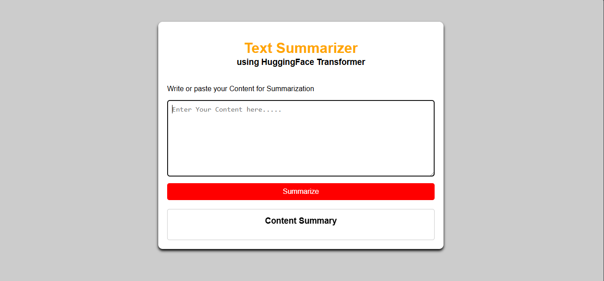
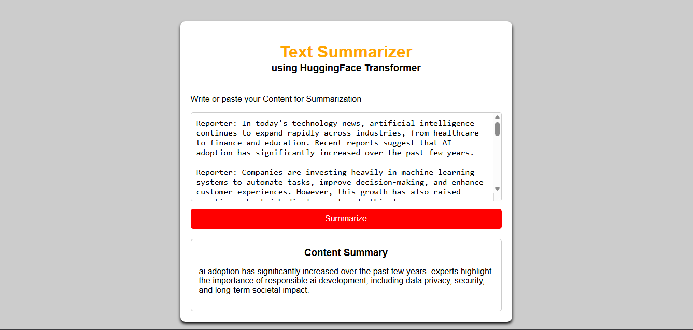

# 🧠 Text Summarizer App using T5 Transformer

A powerful NLP-based Text Summarization Web Application built with **FastAPI** and **Hugging Face Transformers**.

This project uses a fine-tuned **T5-small Transformer model** for generating concise summaries from long-form text and dialogue content.

---

# 🚀 Features

- ✨ Transformer-based Text Summarization
- ⚡ FastAPI Backend
- 🎨 Responsive Frontend using HTML & CSS
- 🤖 Hugging Face T5-small Model
- 📄 REST API Support
- 📚 Interactive Swagger Documentation
- 🖥️ GPU Support (CUDA/MPS) if available
- 🔥 Real-time Summarization
- ☁️ Hugging Face Model Hosting
- 📦 Production-ready ML Workflow

---

# 🛠️ Tech Stack

| Technology | Purpose |
|---|---|
| Python | Backend Programming |
| FastAPI | API Framework |
| Hugging Face Transformers | NLP Model |
| PyTorch | Deep Learning Framework |
| HTML/CSS/JavaScript | Frontend |
| Jinja2 | Template Rendering |

---

# 🤗 Hugging Face Model

The trained summarization model is hosted on Hugging Face Hub:

🔗 Model Repository:

https://huggingface.co/GRAFTERlalith/Text-summarizer-t5

The application automatically downloads the model from Hugging Face during deployment.

---

# 📊 Dataset

This project uses the SAMSum dialogue summarization dataset for training and evaluation.

Dataset:

https://huggingface.co/datasets/samsum

---

# 📂 Project Structure

```plaintext
Text_Summarizer_APP/
│
├── main.py
├── requirements.txt
├── README.md
├── LICENSE
├── .gitignore
│
├── saved_summary_model/    
│
├── Notebooks/
│   └── Text_summarizer_t5.ipynb
│
├── templates/
│   └── index.html
│
├── static/
│   └── style.css
│
├── screenshots/
│   ├── home.png
│   ├── demo-thumbnail.png
│   └── summary_output.png
│
├── data/
│   ├── samsum-train.csv
│   ├── samsum-test.csv
│   └── samsum-validation.csv
│
└── huggingface_upload.py
```

---

# ⚙️ Installation

## 1️⃣ Clone the Repository

```bash
git clone https://github.com/lalithsai-gif/Text_Summarizer_APP.git

cd Text_Summarizer_APP
```

---

## 2️⃣ Create Virtual Environment

### Using Conda

```bash
conda create -n summarizer python=3.10

conda activate summarizer
```

---

## 3️⃣ Install Dependencies

```bash
pip install -r requirements.txt
```

---

# ▶️ Run the Application

```bash
uvicorn main:app --reload
```

Server will start at:

```plaintext
http://127.0.0.1:8000
```

---

# 🌐 API Documentation

FastAPI automatically provides interactive API documentation.

## Swagger UI

```plaintext
http://127.0.0.1:8000/docs
```

---

# 🧠 Model Loading Strategy

The application supports both:

-> Local Model Loading  
-> Hugging Face Cloud Loading

### Local Development

Uses:

```python
./saved_summary_model
```

for faster startup and offline execution.

### Production / Deployment

Automatically downloads model from Hugging Face:

```python
MODEL_NAME = "GRAFTERlalith/Text-summarizer-t5"
```

---

# 📌 API Endpoint

## POST `/summarize/`

### Request Body

```json
{
  "dialogue": "Enter Your Content here..."
}
```

### Response

```json
{
  "summary": "Generated summary text..."
}
```

---

# 💡 Example

## Input

```plaintext
Artificial Intelligence is transforming industries by automating tasks and improving decision-making capabilities...
```

## Output

```plaintext
AI is transforming industries through automation and improved decision-making.
```

---

## 🏠 Home Page



---

## ✨ Generated Summary



# 🎥 Project Demo

Watch the full application demo here:

[](https://youtu.be/lzJuMNIAunA)

# 📦 Requirements

```txt
fastapi
uvicorn
transformers
torch
sentencepiece
jinja2
python-multipart
huggingface_hub
```

---

# 🔒 Git Ignore Configuration

Large trained model files are excluded from GitHub using:

```gitignore
saved_summary_model/
```

This keeps the repository lightweight and production-ready.

---

# 🔮 Future Improvements

- 📁 PDF/Text File Upload
- 🌍 Multi-language Summarization
- 🐳 Docker Deployment
- ☁️ Cloud Deployment
- 📊 Summary Analytics
- 🔐 User Authentication
- 📱 Mobile Responsive UI
- 🧾 Export Summary as PDF

---

# 📸 Application Preview

## Home Page

- Enter text content
- Click summarize
- View generated summary instantly

---

# 👨‍💻 Author

## D. Lalith Sai

Built with ❤️ using FastAPI and Hugging Face Transformers.

---

# 📄 License

This project is licensed under the MIT License.

---

# ⭐ Support

If you found this project useful:

- ⭐ Star this repository
- 🍴 Fork the project
- 🛠️ Contribute improvements